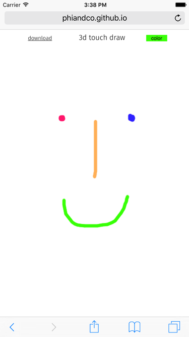

# 3d-touch-draw

Demo of touch/3d touch events in Mobile Safari: http://phiandco.github.io/3d-touch-draw/ 

For iPhone, iPad; works with the Pencil on iPad Pro. Expanded version of @cheesaun's 3d-touch-canvas:
  - Touch drawn on <canvas>,
  - Access a color palette to change color,
  - Download/export into new browser window,
  - Rotate and redraw <canvas> on orientation changes.

### Version
0.1.0

### Screenshot

### Open source forks

Expands and includes:

* 3d-touch-canvas (https://github.com/cheeaun/3d-touch-canvas)
* jscolor (http://jscolor.com)

